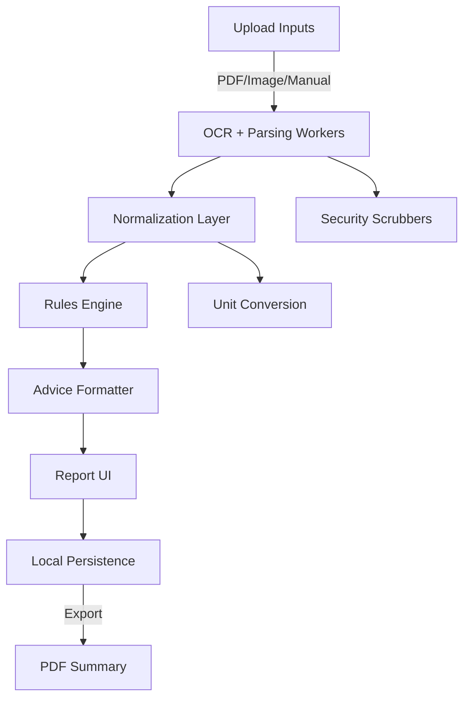

# LabLens Architecture

```mermaid
graph TD
  A[Upload Inputs] -->|PDF/Image/Manual| B[OCR + Parsing Workers]
  B --> C[Normalization Layer]
  C --> D[Rules Engine]
  D --> E[Advice Formatter]
  E --> F[Report UI]
  F --> G[Local Persistence]
  C --> H[Unit Conversion]
  B --> I[Security Scrubbers]
  G -->|Export| J[PDF Summary]
```
