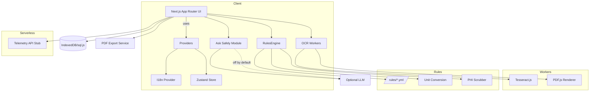

# LabLens Architecture

```mermaid
flowchart TD
  subgraph Client
    UI[Next.js App Router UI] -->|uses| Providers
    Providers --> I18n[I18n Provider]
    Providers --> Store[Zustand Store]
    UI --> OCR[OCR Workers]
    UI --> RulesEngine
    UI --> QA[Ask Safely Module]
  end

  subgraph Workers
    OCR --> Tesseract[Tesseract.js]
    OCR --> PDFJS[PDF.js Renderer]
  end

  subgraph Rules
    RulesEngine --> YAML[/rules/*.yml/]
    RulesEngine --> Units[Unit Conversion]
    RulesEngine --> Security[PHI Scrubber]
  end

  QA --> LLM[Optional LLM]
  QA -.->|off by default| LLM

  UI --> LocalDB[(IndexedDB/sql.js)]
  UI --> Export[PDF Export Service]

  subgraph Serverless
    Telemetry[Telemetry API Stub]
  end

  UI --> Telemetry
```
