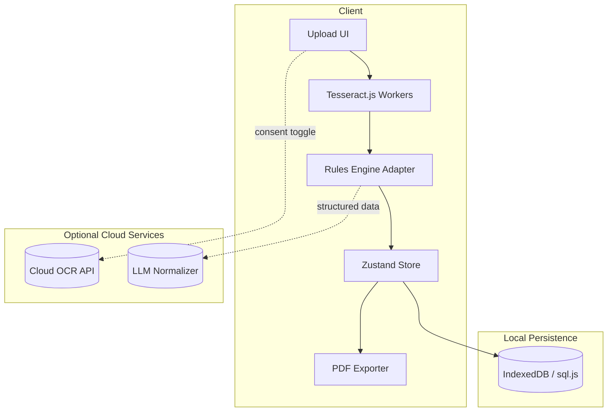

# Architecture Overview

```mermaid
flowchart TD
  subgraph Client
    A[Upload UI]
    B[Tesseract.js Workers]
    C[Rules Engine Adapter]
    D[Zustand Store]
    E[PDF Exporter]
  end

  subgraph Local Persistence
    F[(IndexedDB / sql.js)]
  end

  subgraph Optional Cloud Services
    G[(Cloud OCR API)]
    H[(LLM Normalizer)]
  end

  A --> B --> C --> D --> E
  D --> F
  A -.consent toggle.-> G
  C -.structured data.-> H
```
